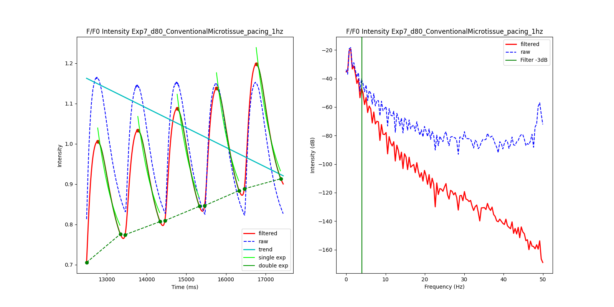
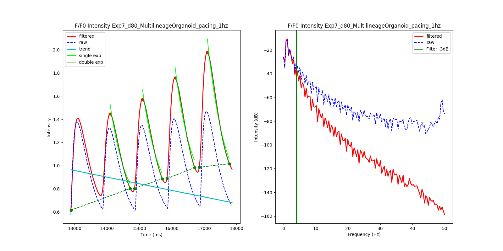

# Calcium Trace Analysis for Cardiac and Multilineage Organoids

Analyze calcium and electrophysiology traces for spontaneously beating and paced
cardiac organoids.

If you find this code useful, please cite:

> Silva, A. C. et al. Developmental co-emergence of cardiac and gut tissues modeled
> by human iPSC-derived organoids. http://biorxiv.org/lookup/doi/10.1101/2020.04.30.071472
> (2020) doi:10.1101/2020.04.30.071472.

## Installing

This script requires Python 3.7 or greater and several additional python packages.
This code has been tested on OS X 10.15 and Ubuntu 18.04, but may work with minor
modification on other systems.

It is recommended to install and test the code in a virtual environment for
maximum reproducibility:

```{bash}
# Create the virtual environment
python3 -m venv ~/org_env
source ~/org_env/bin/activate
```

All commands below assume that `python3` and `pip3` refer to the binaries installed in
the virtual environment. Commands are executed from the base of the git repository
unless otherwise specified.

```{bash}
pip install --upgrade pip

# Install the required packages
pip3 install -r requirements.txt

# Build and install all files in the multilineage organoid package
python3 setup.py install
```

The `multilineage_organoid` package can also be installed as a python package:

```{bash}
python3 setup.py bdist_wheel
pip3 install dist/multilineage_organoid-*.whl
```

After installation, the following scripts will be available:

* `analyze_ca_data.py`: Analyze calcium traces and estimate waveform parameters

The scripts can also be used in an `inplace` install, when run locally from the
`scripts` directory.

```{bash}
python3 setup.py build_ext --inplace
cd scripts
```

Where each script is run from the current directory (e.g. `./analyze_ca_data.py`, etc)

## Analyzing trace data

The main tool to analyze traces is `./analyze_ca_data.py`. To analyze the example
data, consisting of one multilineage organoid sample with four ROIs, and one
cardiac microtissue sample with two ROIs, both paced at 1 Hz, run:

```{bash}
scripts/analyze_ca_data.py ./data --data-type ca --outdir ./filtered --plot-type all --plotdir ./plots
```

This will produce three files in `./filtered`:

* `Exp7_d80_ConventionalMicrotissue_pacing_1hz.csv`: Filtered traces for the microtissue
* `Exp7_d80_MultilineageOrganoid_pacing_1hz.csv`: Filtered traces for the multilineage organoid
* `stats.xlsx`: Summary stats aggregated over all traces

And an additional six files in `./plots`:

* `Exp7_d80_ConventionalMicrotissue_pacing_1hz_01.png`: First trace in the microtissue file
* `Exp7_d80_ConventionalMicrotissue_pacing_1hz_02.png`: Second trace in the microtissue file
* `Exp7_d80_MultilineageOrganoid_pacing_1hz_01.png`: First trace in the multilineage file
* ... etc

The microtissue traces should look like:



Similarly, the multilineage organoid traces should look like:



The complete set of expected output images can be found in the `./images` folder.

## Testing

The modules defined in `multilineage_organoid` have a test suite that can be run
using the `pytest` package.

```{bash}
python3 -m pytest tests
```

## Documentation

Documentation for the scripts and individual modules can be built using the
`sphinx` package.

```{bash}
cd docs
make html
```

Documentation will then be available under `docs/_build/html/index.html`
